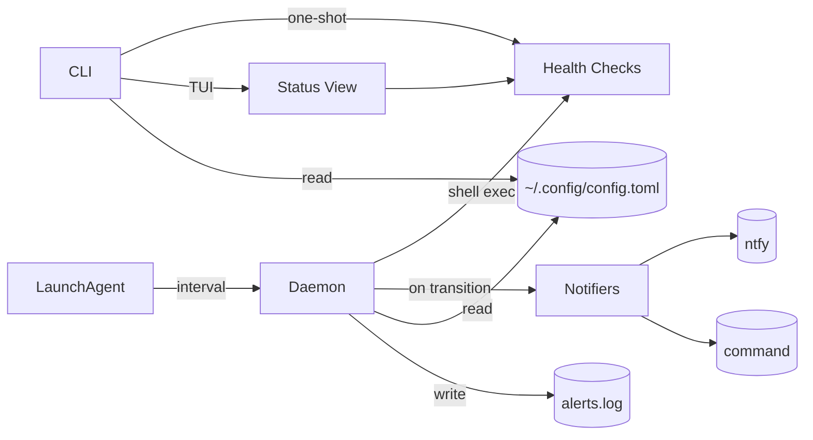
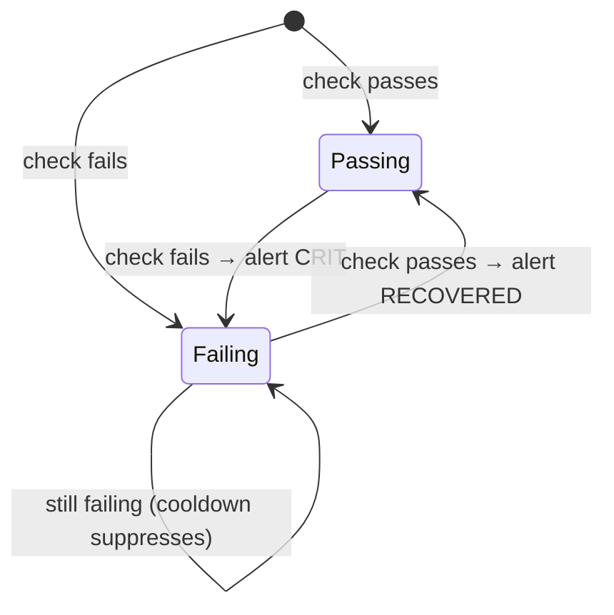

# Architecture

Local host health-check daemon. Runs checks, tracks state, sends alerts on transitions.

## System Context

## Components

| Component | Responsibility |
|-----------|---------------|
| **cmd** | Cobra CLI: check, status, daemon, init, validate, notify |
| **runner** | Execute checks, filter, collect results |
| **daemon** | Continuous loop, fail/recover transition tracking |
| **notify** | Alert backends (ntfy, command), cooldown logic |
| **tui** | Bubbletea status display, watch mode |
| **config** | TOML parsing, validation |

## Check Lifecycle

## Key Design Decisions

| Decision | Choice | Why |
|----------|--------|-----|
| Shell-exec checks | Run any command | Maximum flexibility, no custom check API |
| Detect only (v1) | No auto-remediation | Keep it simple, alert humans |
| Transition alerts | Only on state change | No alert spam |
| Cooldown per backend | Configurable per notifier | Different urgency per channel |
| Status TUI bypasses bubbletea in non-watch | Direct View() render | Works without TTY (CI, pipes) |
