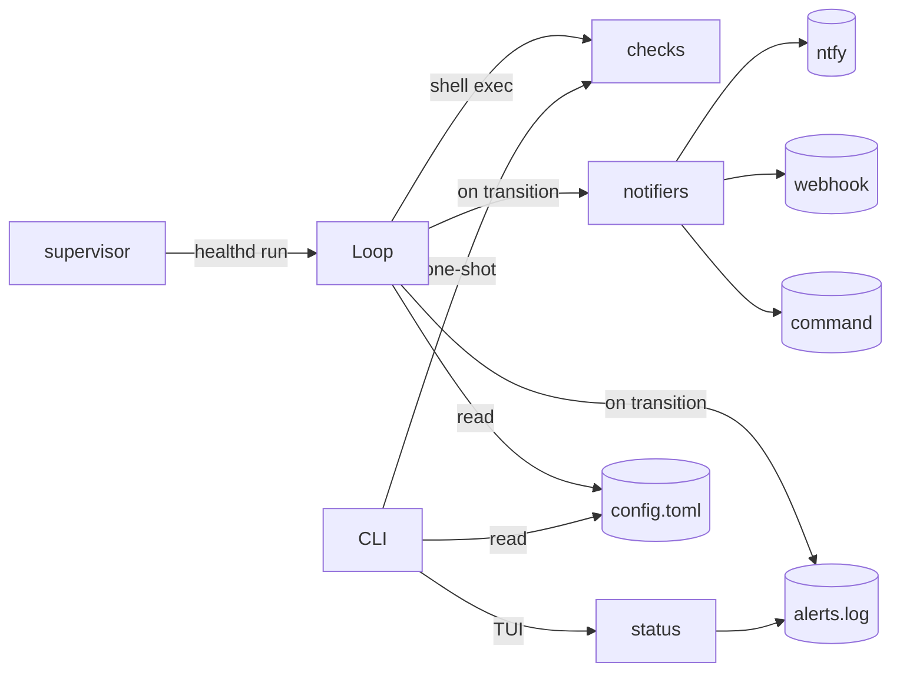
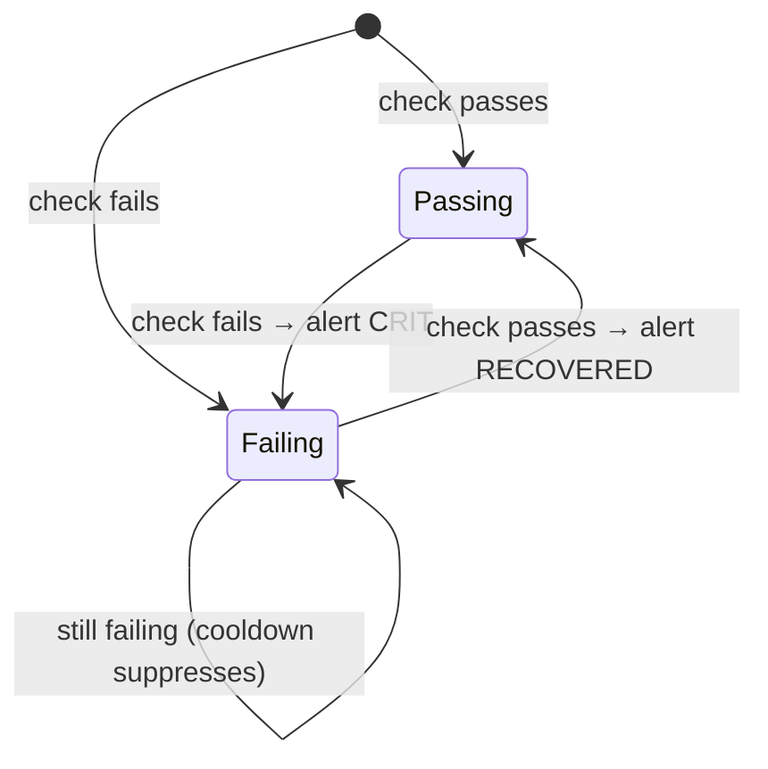

# Architecture

Local host health-check daemon. Runs checks, tracks state, and alerts on fail/recover transitions.

## System context

```mermaid
graph LR
  PC[supervisor] -->|healthd run| Loop
  Loop -->|shell exec| Checks[checks]
  Loop -->|on transition| Notify[notifiers]
  Loop -->|on transition| Alerts[(alerts.log)]
  Notify --> Ntfy[(ntfy)]
  Notify --> Webhook[(webhook)]
  Notify --> Cmd[(command)]
  CLI[CLI] -->|one-shot| Checks
  CLI -->|TUI| Status[status]
  Status --> Alerts
  Loop & CLI -->|read| Config[(config.toml)]
```

Default config: `~/.config/healthd/config.toml`. Default alerts log: `~/.local/state/healthd/alerts.log`.

## Packages

| Package | Responsibility |
|---|---|
| `cmd/` | Cobra CLI: `check`, `status`, `run`, `init`, `validate`, `notify` |
| `internal/runner` | Execute checks, filter, collect results |
| `internal/loop` | Continuous loop and fail/recover transition tracking |
| `internal/notify` | ntfy, webhook, and command backends plus cooldown |
| `internal/alertlog` | Append-only alerts log used by the TUI |
| `internal/tui` | Bubbletea status display and watch mode |
| `internal/config` | TOML parse and validation |

## Check lifecycle

```mermaid
stateDiagram-v2
  [*] --> Passing: check passes
  [*] --> Failing: check fails
  Passing --> Failing: check fails → alert CRIT
  Failing --> Passing: check passes → alert RECOVERED
  Failing --> Failing: still failing (cooldown suppresses)
```

Shell checks and command notifiers own a process group on macOS and Linux.
On timeout or parent cancellation they send TERM, allow 100 ms for cleanup,
then send KILL. Exited shell leaders remain unreaped until group cleanup is
complete, preventing signals from targeting a reused process-group ID. Normal
shell exit also ends remaining group members. Pipe draining is bounded to
100 ms; a drain or supervision failure cannot pass an output expectation.
Commands must remain in their group and must not daemonize. A command that
escapes the group cannot be cleaned up as an owned child, but inherited output
pipes still cannot keep the check or notifier waiting indefinitely.

Each command retains at most 64 KiB from each output stream, including command
notifier failure messages. Check-local timeouts remain distinct from parent
cancellation; command notifier errors preserve the context cancellation cause.

Numeric expectations reject NaN output and NaN `min`/`max` bounds. Infinity
retains numeric ordering: `+Inf` exceeds finite maxima, `-Inf` falls below
finite minima, and infinite bounds remain valid. Invalid numeric output uses
a fixed failure reason without copying the output into alerts.

## Design decisions

| Decision | Choice | Why |
|---|---|---|
| Check model | Shell-exec any command | Flexible without a custom check plugin API |
| Remediation | Detect/report only | Keep the daemon simple; humans or supervisors act |
| Alerting | Transition-only | Avoid spam while a check stays failed |
| Notify cooldown | Shared quiet window per check | Suppress rapid re-alerts across backends |
| Non-watch status | Render `View()` directly | Works without a TTY (CI, pipes) |
