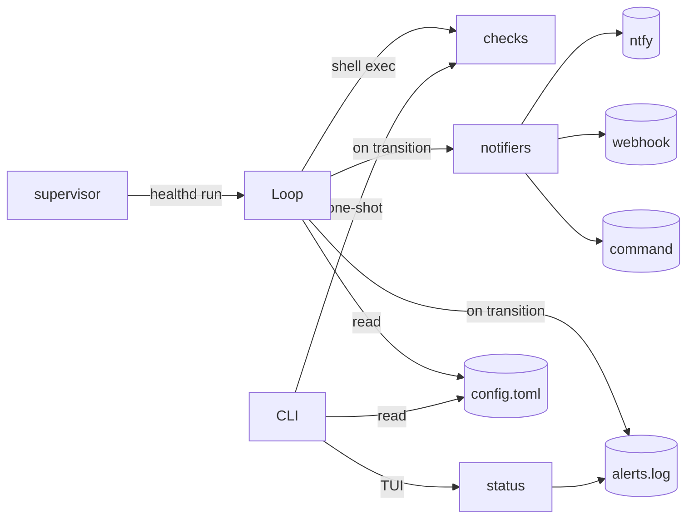
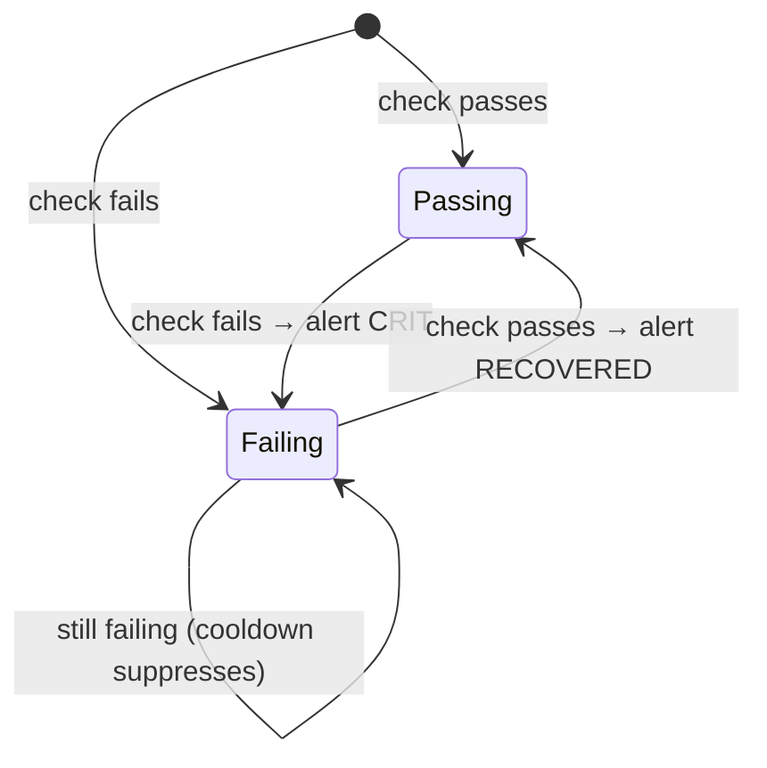

# Architecture

Local host health-check daemon. Runs checks, tracks state, and alerts on fail/recover transitions.

## System context

```mermaid
graph LR
  PC[supervisor] -->|healthd run| Loop
  Loop -->|shell exec| Checks[checks]
  Loop -->|on transition| Notify[notifiers]
  Loop -->|on transition| Alerts[(alerts.log)]
  Notify --> Ntfy[(ntfy)]
  Notify --> Webhook[(webhook)]
  Notify --> Cmd[(command)]
  CLI[CLI] -->|one-shot| Checks
  CLI -->|TUI| Status[status]
  Status --> Alerts
  Loop & CLI -->|read| Config[(config.toml)]
```

Default config: `~/.config/healthd/config.toml`. Default alerts log: `~/.local/state/healthd/alerts.log`.

## Packages

| Package | Responsibility |
|---|---|
| `cmd/` | Cobra CLI: `check`, `status`, `run`, `init`, `validate`, `notify` |
| `internal/runner` | Execute checks, filter, collect results |
| `internal/loop` | Continuous loop and fail/recover transition tracking |
| `internal/notify` | ntfy, webhook, and command backends plus cooldown |
| `internal/alertlog` | Append-only alerts log used by the TUI |
| `internal/tui` | Bubbletea status display and watch mode |
| `internal/config` | TOML parse and validation |

## Check lifecycle

```mermaid
stateDiagram-v2
  [*] --> Passing: check passes
  [*] --> Failing: check fails
  Passing --> Failing: check fails → alert CRIT
  Failing --> Passing: check passes → alert RECOVERED
  Failing --> Failing: still failing (cooldown suppresses)
```

## Design decisions

| Decision | Choice | Why |
|---|---|---|
| Check model | Shell-exec any command | Flexible without a custom check plugin API |
| Remediation | Detect/report only | Keep the daemon simple; humans or supervisors act |
| Alerting | Transition-only | Avoid spam while a check stays failed |
| Notify cooldown | Shared quiet window per check | Suppress rapid re-alerts across backends |
| Non-watch status | Render `View()` directly | Works without a TTY (CI, pipes) |
